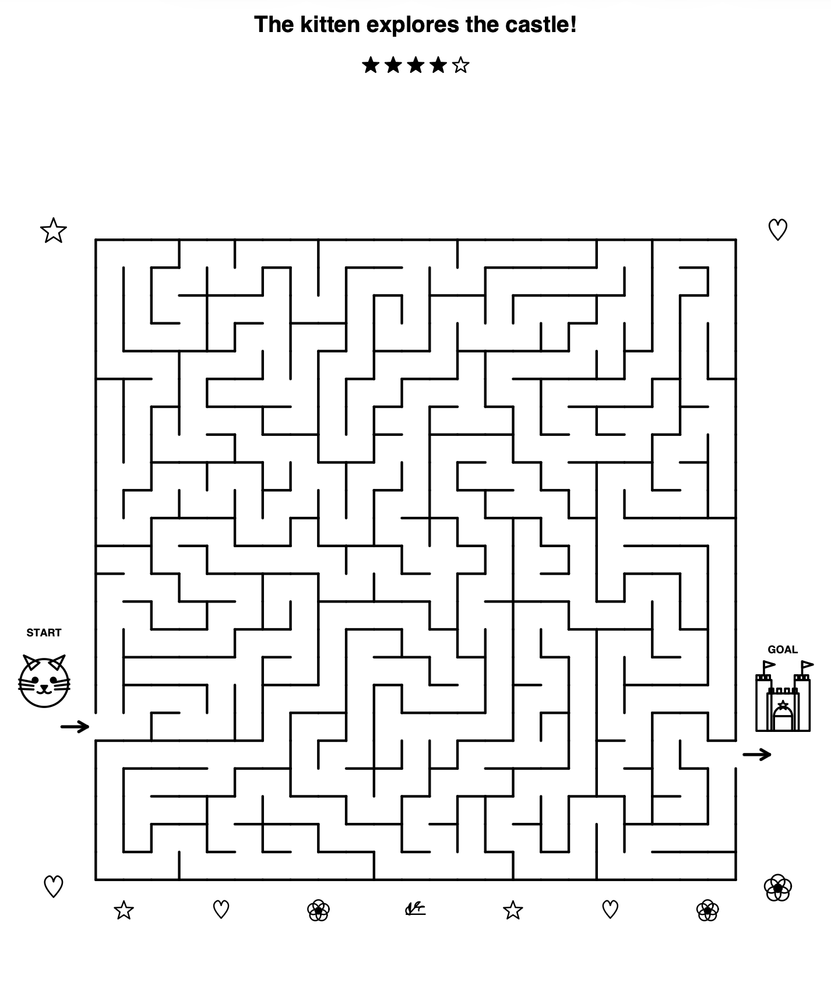

# 🧩✨ Mazerator

Mazerator is a Maze Booklet Generator: a tool to create a printable A4 black-and-white PDF with a configurable number of pages/mazes whose difficulty increases page by page. The mazes target children of different ages, depending on the desired complexity of the generated mazes, and are decorated with fantasy line-art (unicorns, cats, bunnies, butterflies, castles, rainbows, ...).

It was created to avoid asking an AI agent to generate it multiple ones. 

This works completely offline, without AI, and its results have been successfully tested against a curious 4 years old beta user.

For Claude Code maintainer context, conventions, and CI/testing notes, see
[`CLAUDE.md`](./CLAUDE.md).

## 📸 Example output

_Representative preview of a generated page style (print-friendly black-and-white)._

> Note: the source code, comments and docs are in English. PDF text/theme
> localization is configurable with `--locale`; default is English.

An complete output PDF example can be found in [docs/example-output.pdf](./docs/example-output.pdf)

## 🎚️ Adjustable difficulty

One knob controls the **overall/average difficulty** while always keeping a
**gradual increase** from the first to the last page. Change it either on the
command line (`--difficulty F`) or by editing `DEFAULT_DIFFICULTY` in the script.

Indicative grid side (first page -> last page):

| difficulty | first page | last page |
|-----------:|:----------:|:---------:|
| 1          | 6x6        | 12x12     |
| 2          | 8x8        | 16x16     |
| 2.5        | 9x9        | 18x18     |
| 3 (default) | 10x10   | 20x20     |
| 4        | 12x12      | 24x24     |
| ...        |            |           |

## 🎲 Every run is different

Each run produces different mazes. Randomness covers:
- the internal paths (recursive-backtracker carving, seeded from system entropy);
- the theme/illustration assigned to each page.

Every maze is "perfect" (a spanning tree): exactly one solution exists.

## 🧠 Guaranteed-long, genuinely complex solutions

A maze that *looks* hard (say 20x20) is useless if its entrance and exit happen
to sit next to each other. To prevent that, the generator:

- places the entrance (top/left edge) and exit (bottom/right edge) at the two
  border cells whose connecting route through the maze is the **longest**, and
- **re-carves** the maze until that forced route is at least
  `MIN_PATH_FACTOR * n*n` cells long for an `n x n` maze (`0.5`, i.e. half of
  all cells, by default).

So a 20x20 maze always forces the child through at least 200 cells. Because the
maze stays a perfect maze, it keeps the recursive-backtracker's dead ends and
junctions, so there are always wrong turns and real choices - not a single
obvious corridor. Both properties are covered by the test suite
(`TestSolutionLength` and `TestMazeComplexity`).

`0.5` is a strong, practical default; increase it with
`--min-path-factor F` (or change `MIN_PATH_FACTOR` in the source) for longer
routes, at the cost of more re-carving attempts and potentially more warnings.

## 🔬 How it works (the theory)

### The maze as a graph

Model the `n x n` grid as a graph `G = (V, E)`: every cell is a vertex
(`|V| = n^2`) and every pair of orthogonally adjacent cells is connected by an
edge (a potential passage). Carving the maze means choosing a subset of those
edges to leave open.

### Why the maze is "perfect": spanning trees

The generator produces a **spanning tree** of `G`: a subgraph that is
*connected* (every cell reachable) and *acyclic* (no loops). Two consequences
follow directly from tree theory:

- A tree on `|V|` vertices has exactly `|V| - 1` edges, so the maze always has
  exactly `n^2 - 1` open passages. (Asserted in `test_perfect_maze_is_a_spanning_tree`.)
- In a tree there is a **unique simple path** between any two vertices. Hence the
  maze is "perfect": every pair of cells - in particular entrance and exit - is
  joined by exactly one solution, with no shortcuts and no isolated regions.

### Carving: randomized depth-first search (recursive backtracker)

The tree is grown with the **recursive-backtracker** algorithm, a randomized DFS:

1. Start at a random cell, mark it visited, push it on a stack.
2. From the top-of-stack cell, pick a random *unvisited* neighbour, open the wall
   to it, mark it visited, push it.
3. If the current cell has no unvisited neighbour, **pop** (backtrack).
4. Repeat until the stack is empty.

Because every cell is visited exactly once and each is linked to the frontier by
a single opened edge, the opened edges form a spanning tree by construction. The
visit order is a uniformly random neighbour choice, so the seed (system entropy
by default) fully determines the maze. Runtime is `O(n^2)` time and space.
DFS carving is chosen deliberately: it has a strong "river" bias toward long,
winding corridors, which yields fewer-but-longer dead ends and long solutions -
exactly what we want.

### Forcing a long solution: tree diameter, restricted to the border

A spanning tree alone does **not** guarantee a hard maze - if entrance and exit
land in nearby cells, the unique path between them can be trivially short. The
length of the forced route equals the **tree distance** (number of edges on the
unique path) between the entrance and exit cells.

To maximize it we want the two endpoints to be as far apart as possible. The
maximum tree distance over *all* pairs is the tree's **diameter**. We restrict
the endpoints to the border (entrances on the top/left edge, exits on the
bottom/right edge, for a natural flow), so we compute the longest path over the
eligible border pairs:

- run a breadth-first search (BFS) from each candidate border cell - BFS gives
  exact shortest distances because a tree path is unique;
- take the entrance/exit pair achieving the maximum distance.

This is `O(b * n^2)` per maze, where `b = O(n)` is the number of border cells.

### The `0.5 * n^2` guarantee

We **reject and re-carve** until the longest border route reaches at least
`MIN_PATH_FACTOR * n^2` cells (`0.5` by default). If a requested factor is too
aggressive for the retry budget, generation keeps the best maze found and emits
a warning with requested vs achieved factor. In practice, `0.5` is robust while
higher values progressively trade generation speed/reliability for longer paths.

### Complexity: dead ends and branching

In tree terms a **dead end** is a leaf (degree-1 cell) and a **junction** is a
vertex of degree `>= 3` (a real choice point). A perfect maze with many of both
cannot degenerate into a single obvious corridor. Randomized DFS keeps both
counts high (they grow roughly linearly with `n^2`), which `TestMazeComplexity`
asserts with conservative lower bounds.

## 🗂️ Project structure

- `src/maze_generator/generate_mazes.py`: core generator logic (library-first).
- `src/maze_generator/cli.py`: CLI argument parsing + command execution.
- `tests/`: standard test-discovery layout.
- `output/`: default folder for generated PDFs.
- `pyproject.toml`: project metadata, dependencies, console script.

## 🚀 Usage

With UV (recommended; reproducible and zero setup):

    uv run mazerator

This command is tested and works on a fresh clone.

Without UV (standard Python + pip):

    python3 -m venv .venv
    source .venv/bin/activate
    python3 -m pip install --upgrade pip
    pip install -e .
    mazerator

### Options

    --output FILE          output PDF (default: output/mazes.pdf)
    --pages N              number of mazes (default: 20)
    --difficulty F         overall/average difficulty (default: 3.0)
    --seed N               fixed seed -> byte-identical, reproducible PDF
    --min-path-factor F    minimum solution length as a fraction of n*n cells,
                           0 < F <= 1 (default: 0.5). Higher = longer forced
                           route, but more re-carving; very high values may be
                           hard to hit for every page/seed. If the target is
                           not reached within retry limits, generator
                           keeps the best maze found and prints a warning.
    --locale LANG          text/theme localization (default: en). Currently:
                           ar, bn, de, el, en, es, fr, hi, it, pl, pt, ro, ru, uk, zh
                           (default output path remains output/mazes.pdf unless
                           you pass --output)

### Examples

    uv run mazerator                  # default (10x10 -> 20x20)
    uv run mazerator --difficulty 2   # gentler (8x8 -> 16x16)
    uv run mazerator --difficulty 4   # very challenging
    uv run mazerator --seed 42        # always the same PDF
    uv run mazerator --min-path-factor 0.65   # longer forced routes
    uv run mazerator --locale it      # Italian labels + theme text
    uv run mazerator --locale zh      # Chinese labels + theme text

## ✅ Tests

Run the full suite (including PDF/integration tests) with UV so there are no
skips:

    uv run --with reportlab python -m unittest discover -s tests -p "test_*.py" -v

Without UV:

    python3 -m venv .venv
    source .venv/bin/activate
    python3 -m pip install --upgrade pip
    pip install -e .
    python3 -m unittest discover -s tests -p "test_*.py" -v

## 📁 Files

- `src/maze_generator/generate_mazes.py` - generator implementation
- `tests/test_*.py`                      - modular unittest suite by concern

## 📜 License

This project is licensed under the **Apache License 2.0** (see `LICENSE`).

For attribution consistency, the repository also includes a `NOTICE` file.
If used in commercial products/services, keep the NOTICE attribution (or an
equivalent mention in your docs/about page).
